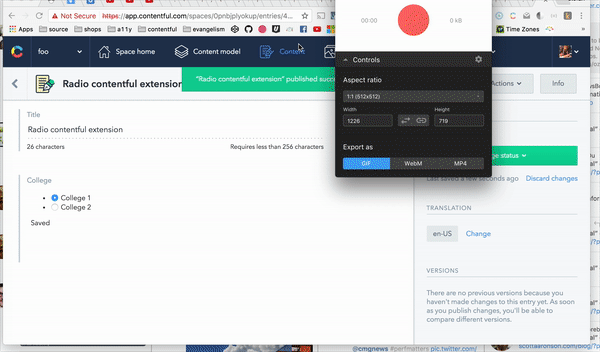

# contentful-example-ref-ui-extensions

Quick and dirty example on how to change the "look" of the Contentful Reference Field

This example is heavily influenced by the [Spotify UI-Extension](https://github.com/tuunanen/cf-ui-ext-spotify).

The instructions are the same. :)

In short:

 - make sure to set a valid `.env` file
 - do `source .env`
 - `npm run create`
 - `npm run update` (if needed)
 - `npm run dev` (for development)

## Development

For development you can use the `npm run dev` command. There is one thing to mention though.

The workflow for development is that you register a UI-extension that will display `localhost:8000` in an iframe (UI-extension are placed in an iframe anyways). For security reasons the web app only allows connections to secure hosts.

So when you execute `npm run dev` a new http-server will be started which expects `cert.pem` and `key.pem` to be present.
For my quick and dirty try out I followed [this guide](https://msol.io/blog/tech/create-a-self-signed-ssl-certificate-with-openssl/) and it worked fine.

